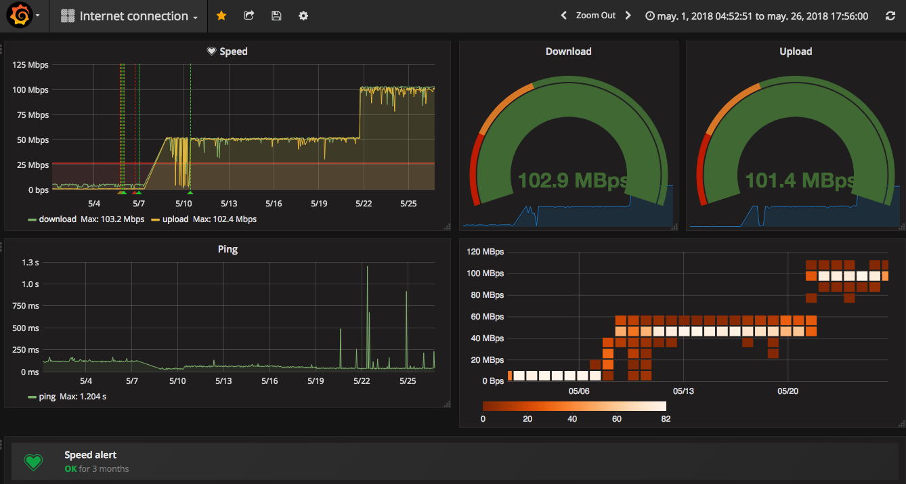

## Monitoring the bandwidth (part 2) also with Nameko

This days I've playing with [Nameko](https://nameko.readthedocs.io/en/stable/). The Python framework for building microservices. I've done one small [POC](https://github.com/gonzalo123/nameko_poc). Today I want to upgrade one small [pet project](https://github.com/gonzalo123/speed) that I've got in my house to monitor the bandwidth of my internet connection. I want to use one nameko microservice using the Timer entrypoint

That's the worker
```python
from nameko.timer import timer
import datetime
import logging
import os
import speedtest
from dotenv import load_dotenv
from influxdb import InfluxDBClient

current_dir = os.path.dirname(os.path.abspath(__file__))
load_dotenv(dotenv_path="{}/.env".format(current_dir))


class SpeedService:
    name = "speed"

    def __init__(self):
        self.influx_client = InfluxDBClient(
            host=os.getenv("INFLUXDB_HOST"),
            port=os.getenv("INFLUXDB_PORT"),
            database=os.getenv("INFLUXDB_DATABASE")
        )

    @timer(interval=3600)
    def speedTest(self):
        logging.info("speedTest")
        current_time = datetime.datetime.utcnow().isoformat()
        speed = self.get_speed()

        self.persists(measurement='download', fields={"value": speed['download']}, time=current_time)
        self.persists(measurement='upload', fields={"value": speed['upload']}, time=current_time)
        self.persists(measurement='ping', fields={"value": speed['ping']}, time=current_time)

    def persists(self, measurement, fields, time):
        logging.info("{} {} {}".format(time, measurement, fields))
        self.influx_client.write_points([{
            "measurement": measurement,
            "time": time,
            "fields": fields
        }])

    @staticmethod
    def get_speed():
        logging.info("Calculating speed ...")
        s = speedtest.Speedtest()
        s.get_best_server()
        s.download()
        s.upload()

        return s.results.dict()

```

I need to adapt my docker-compose file to include the RabbitMQ server (Nameko needs a RabbitMQ message broker)
```yml
version: '3'

services:
  speed.worker:
    container_name: speed.worker
    image: speed/worker
    restart: always
    build:
      context: ./src/speed.worker
      dockerfile: .docker/Dockerfile-worker
    command: /bin/bash run.sh
  rabbit:
    container_name: speed.rabbit
    image: rabbitmq:3-management
    restart: always
    ports:
      - "15672:15672"
      - "5672:5672"
    environment:
      RABBITMQ_ERLANG_COOKIE:
      RABBITMQ_DEFAULT_VHOST: /
      RABBITMQ_DEFAULT_USER: ${RABBITMQ_DEFAULT_USER}
      RABBITMQ_DEFAULT_PASS: ${RABBITMQ_DEFAULT_PASS}
  influxdb:
    container_name: speed.influxdb
    image: influxdb:latest
    restart: always
    environment:
    - INFLUXDB_DB=${INFLUXDB_DB}
    - INFLUXDB_ADMIN_USER=${INFLUXDB_ADMIN_USER}
    - INFLUXDB_ADMIN_PASSWORD=${INFLUXDB_ADMIN_PASSWORD}
    - INFLUXDB_HTTP_AUTH_ENABLED=${INFLUXDB_HTTP_AUTH_ENABLED}
    volumes:
    - influxdb-data:/data
  grafana:
    container_name: speed.grafana
    build:
      context: ./src/grafana
      dockerfile: .docker/Dockerfile-grafana
    restart: always
    environment:
    - GF_SECURITY_ADMIN_USER=${GF_SECURITY_ADMIN_USER}
    - GF_SECURITY_ADMIN_PASSWORD=${GF_SECURITY_ADMIN_PASSWORD}
    - GF_USERS_DEFAULT_THEME=${GF_USERS_DEFAULT_THEME}
    - GF_USERS_ALLOW_SIGN_UP=${GF_USERS_ALLOW_SIGN_UP}
    - GF_USERS_ALLOW_ORG_CREATE=${GF_USERS_ALLOW_ORG_CREATE}
    - GF_AUTH_ANONYMOUS_ENABLED=${GF_AUTH_ANONYMOUS_ENABLED}
    ports:
    - "3000:3000"
    depends_on:
    - influxdb
volumes:
  influxdb-data:
    driver: local
```

And that's all. Over engineering to control my Internet Connection? Maybe, but that's the way I learn new stuff :)

